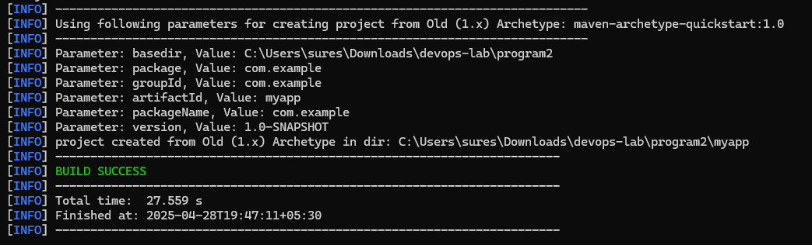
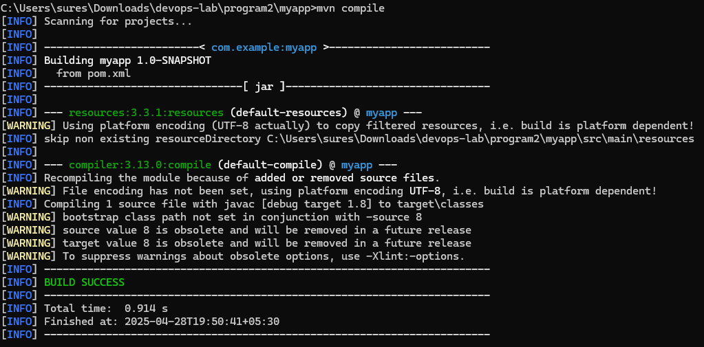
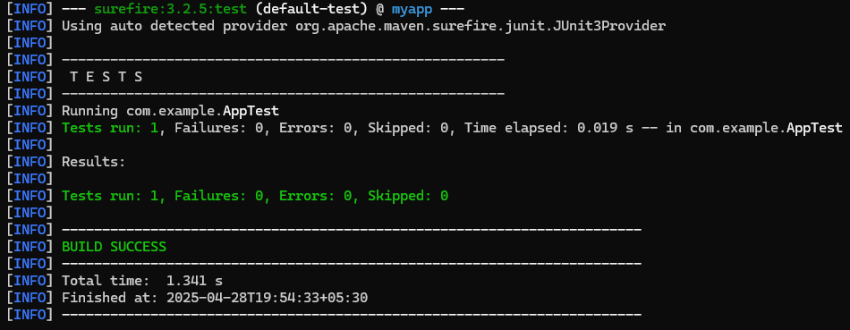
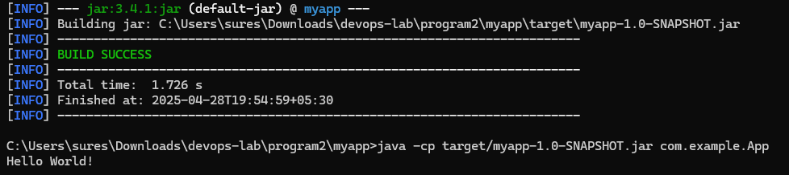

# Output

```
cd myapp

// Compile the Project
mvn compile

// Run the Unit Tests
mvn test

// Package the project into a JAR
mvn package

// Run the application (using JAR)
java -cp target/myapp-1.0-SNAPSHOT.jar com.example.App
```





