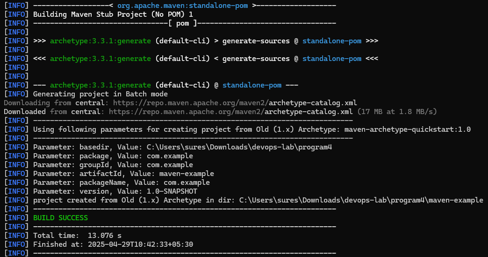
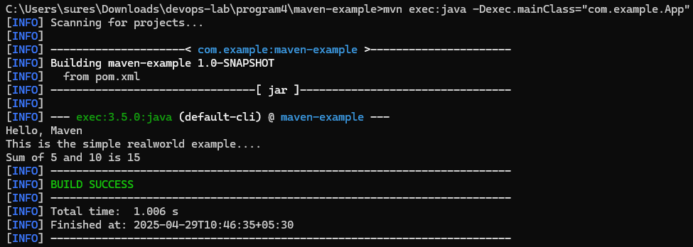
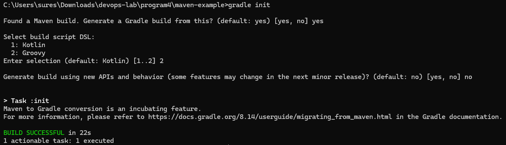
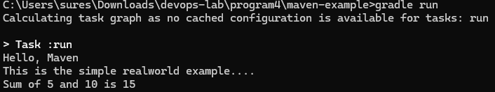

# Output

```

// Creating a Maven Project
mvn archetype:generate -DgroupId=com.example -DartifactId=maven-example -DarchetypeArtifactId=maven-archetype-quickstart -DinteractiveMode=false
cd maven-example

// Run the Project
mvn clean install
mvn exec:java -Dexec.mainClass="com.example.App"

// Migrate the Maven Project to Gradle
gradle init

// Run the Gradle Project
gradle build
gradle run
```

```

// Add this to build.gradle

task run(type: JavaExec) {
    main = 'com.example.App'
    classpath = sourceSets.main.runtimeClasspath
}
```





